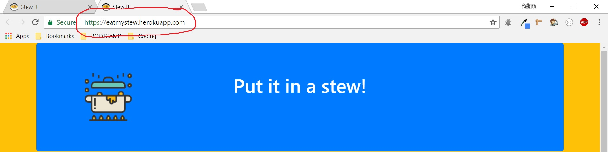
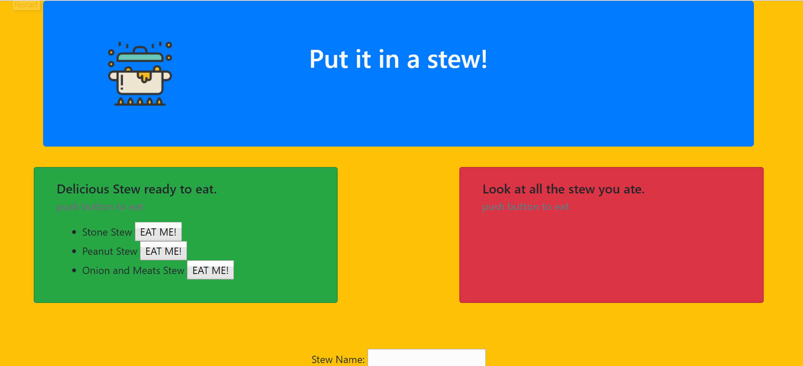

# stew
Make a stew...and eat it!

## Description
  A web app where you can write down the name of any stew you desire, and with the press of a button devour your delicious creation!

## Install Instructions
  * Open your command line
  * Navigate to the path where you cloned stew
  * type `npm install` to install npm packages:
    *  express
    *  express-handlebars
    *  mysql
    *  body-parser
    *  method-override
  * type `nodemon server.js` to run the app
  * open your browser and type `localhost:8000` in the search bar.
  * create your stew and feast!

  ## Walkthrough
  
  1. To visit Heroku deployed web app, type `https://eatmystew.herokuapp.com/` in your browser or click this link: [Make A Stew](https://eatmystew.herokuapp.com/ "Heroku deployed web app")
  
  
  
  3. Type in the name of your stew and submit it to the "ready to eat" box. 
  4. Press the devour button to feast on your stew!
    